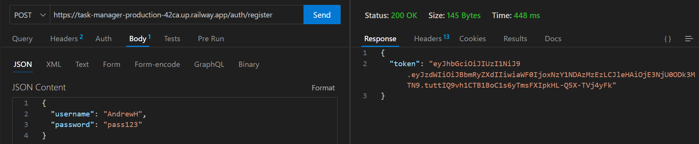
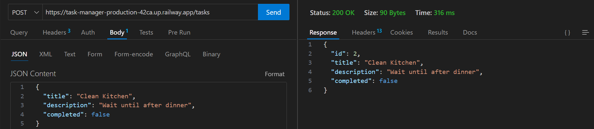
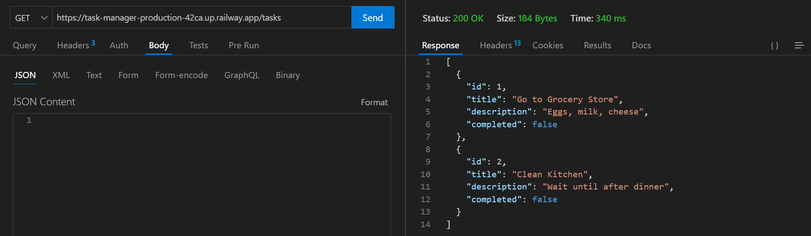

# Task Manager API

A RESTful API built with Spring Boot for managing tasks with JWT authentication. This project demonstrates CRUD operations, REST principles, Spring Security, and Spring Data JPA integration with PostgreSQL database.

## 🌐 Live Demo
The API is deployed and accessible at:
**https://task-manager-api-mope.onrender.com**

## 🛠️ Technologies Used

- Java 21
- Spring Boot 3.5.8
- Spring Web (REST API)
- Spring Data JPA (Database operations)
- Spring Security (JWT Authentication)
- PostgreSQL (Relational database)
- Docker (Containerization)
- Render (Cloud deployment)
- Maven (Project management)

## ✨ Features

- User registration and authentication with JWT
- Token-based authorization
- Create new tasks
- Retrieve all tasks or a specific task by ID
- Update existing tasks
- Delete tasks
- Auto-generated task IDs
- JSON request/response format
- RESTful API design
- Persistent data storage with PostgreSQL
- Proper HTTP status code handling (200, 400, 401, 403, 404)
- Cloud deployment with live public URL
- Dockerized for consistent deployment

## 🚀 Getting Started

### Prerequisites

- Java 17 or higher
- Maven (included via Maven Wrapper)
- PostgreSQL installed locally OR access to a cloud PostgreSQL database
- Docker (optional, for containerized deployment)

### Database Setup

1. Install PostgreSQL on your machine (or use a cloud service like Render, Supabase, or Railway)

2. Create a database for the application:
   - Open PostgreSQL command line or pgAdmin
   - Create a new database named 'taskmanager' (or your preferred name)

3. Configure the database connection:
   - Open `src/main/resources/application.properties`
   - Update the following properties with your database credentials:

```properties
spring.datasource.url=jdbc:postgresql://localhost:5432/taskmanager
spring.datasource.username=your_username
spring.datasource.password=your_password
spring.jpa.hibernate.ddl-auto=update
spring.jpa.properties.hibernate.dialect=org.hibernate.dialect.PostgreSQLDialect
```

### Running the Application Locally

1. Clone the repository:
```bash
git clone https://github.com/Andy916/task-manager.git
cd task-manager
```

2. Set up your database configuration (see Database Setup above)

3. Run the application:
```bash
./mvnw spring-boot:run
```

4. The API will be available at: `http://localhost:8080`

### Stopping the Application

Press `Ctrl + C` in the terminal, then confirm to terminate the batch job.

## 📡 API Endpoints

### 🔓 Authentication (Public - No token required)

#### Register a New User
```
POST /auth/register
Content-Type: application/json
```

**Request Body:**
```json
{
  "username": "your_username",
  "password": "your_password"
}
```

**Example Response:**
```json
{
  "token": "eyJhbGciOiJIUzI1NiJ9..."
}
```

#### Login
```
POST /auth/login
Content-Type: application/json
```

**Request Body:**
```json
{
  "username": "your_username",
  "password": "your_password"
}
```

**Example Response:**
```json
{
  "token": "eyJhbGciOiJIUzI1NiJ9..."
}
```

### 🔒 Tasks (Protected - Requires JWT token)

**All task endpoints require an Authorization header:**
```
Authorization: Bearer YOUR_TOKEN_HERE
```

#### Get All Tasks
```
GET /tasks
```
Returns a list of all tasks.

**Example Response:**
```json
[
  {
    "id": 1,
    "title": "Buy groceries",
    "description": "Milk and eggs",
    "completed": false
  },
  {
    "id": 2,
    "title": "Learn Spring Boot",
    "description": "Build a REST API",
    "completed": true
  }
]
```

#### Get Task by ID
```
GET /tasks/{id}
```
Returns a specific task by ID.

**Example Response (200 OK):**
```json
{
  "id": 1,
  "title": "Buy groceries",
  "description": "Milk and eggs",
  "completed": false
}
```

**Example Response (404 Not Found):**
If task doesn't exist, returns 404 status code.

#### Create Task
```
POST /tasks
Content-Type: application/json
```

**Request Body:**
```json
{
  "title": "Buy groceries",
  "description": "Milk and eggs",
  "completed": false
}
```

**Note:** The `completed` field is optional and defaults to `false` if not provided.

**Example Response (200 OK):**
```json
{
  "id": 1,
  "title": "Buy groceries",
  "description": "Milk and eggs",
  "completed": false
}
```

**Example Response (400 Bad Request):**
If the request body is invalid, returns 400 status code.

#### Update Task
```
PUT /tasks/{id}
Content-Type: application/json
```

**Request Body:**
```json
{
  "title": "Buy groceries",
  "description": "Milk, eggs, and bread",
  "completed": true
}
```

**Example Response (200 OK):**
```json
{
  "id": 1,
  "title": "Buy groceries",
  "description": "Milk, eggs, and bread",
  "completed": true
}
```

**Example Response (404 Not Found):**
If task doesn't exist, returns 404 status code.

#### Delete Task
```
DELETE /tasks/{id}
```

**Example Response (200 OK):**
Returns 200 status code with no body if deletion was successful.

**Example Response (404 Not Found):**
If task doesn't exist, returns 404 status code.

## 🔐 Authentication Flow

1. **Register** a new account: `POST /auth/register` with username and password
2. **Receive** a JWT token in the response
3. **Include** the token in the `Authorization` header for all protected endpoints
4. **Token expires** after 24 hours - login again to get a new token

### Example with Thunder Client/Postman:
1. Register or login to get a token
2. Add header to all task requests:
   - **Key:** `Authorization`
   - **Value:** `Bearer YOUR_TOKEN_HERE`

## 🧪 Testing the API

You can test the API using:
- **Thunder Client** (VS Code extension) - Recommended
- **Postman** (Standalone application)
- **cURL** (Command line)

### Example Tests

1. **Register a user**: POST to `https://task-manager-api-mope.onrender.com/auth/register`
2. **Copy the token** from the response
3. **Get all tasks**: GET to `https://task-manager-api-mope.onrender.com/tasks` with Authorization header
4. **Create a task**: POST to `https://task-manager-api-mope.onrender.com/tasks` with Authorization header and JSON body
5. **Update a task**: PUT to `https://task-manager-api-mope.onrender.com/tasks/1` with Authorization header and JSON body
6. **Delete a task**: DELETE to `https://task-manager-api-mope.onrender.com/tasks/1` with Authorization header

**Note:** The first request may take ~30 seconds as the free tier app wakes from sleep.

## 📸 Screenshots

### User Registration

*Creating a new user account and receiving a JWT token*

### Creating a New Task

*Adding a new task to the database with JWT authentication*

### Getting All Tasks

*Retrieving tasks with JWT authentication*

## 📁 Project Structure

```
taskmanager/
├── src/
│   └── main/
│       └── java/
│           └── com/
│               └── andrewdev/
│                   └── taskmanager/
│                       ├── Task.java                    # Entity class (task table)
│                       ├── TaskRepository.java          # Repository (task database operations)
│                       ├── TaskController.java          # REST controller (task endpoints)
│                       ├── User.java                    # Entity class (user table)
│                       ├── UserRepository.java          # Repository (user database operations)
│                       ├── AuthController.java          # REST controller (auth endpoints)
│                       ├── AuthService.java             # Service (registration/login logic)
│                       ├── AuthRequest.java             # DTO (login/register request)
│                       ├── AuthResponse.java            # DTO (JWT token response)
│                       └── security/
│                           ├── JwtUtil.java             # JWT token generation and validation
│                           ├── JwtAuthFilter.java       # Filter (intercepts requests, validates tokens)
│                           └── SecurityConfig.java      # Security configuration
├── Dockerfile                                          # Docker configuration for deployment
└── pom.xml                                             # Maven configuration
```

## 📄 How It Works

### Authentication Flow
1. User sends `POST /auth/register` with username and password
2. `AuthService` hashes the password with BCrypt and saves user to database
3. `JwtUtil` generates a JWT token containing the username (valid for 24 hours)
4. Token is returned to the user

### Request Flow for Protected Endpoints
```
Client sends request to /tasks with Authorization: Bearer TOKEN
    ↓
JwtAuthFilter intercepts the request
    ↓
JwtUtil validates the token and extracts username
    ↓
If valid, request proceeds to TaskController
    ↓
TaskController processes request and returns JSON response
    ↓
Client receives response
```

## 💾 Database

This application uses **PostgreSQL** as its relational database, which means:
- Data persists between application restarts
- Production-ready database system
- Scalable and reliable for real-world applications
- Supports advanced SQL features

The application uses Spring Data JPA with Hibernate to handle database operations, automatically creating and managing the task and user table schemas.

## ☁️ Deployment

This API is deployed on **Render** with:
- PostgreSQL database hosted on Render's free tier
- Docker containerization for consistent builds
- Automatic deployments from GitHub
- Environment variables for secure configuration
- Public HTTPS URL for global access
- Free tier with 90-day database lifecycle (easily renewable)

### Deployment Architecture
- **Web Service**: Dockerized Spring Boot application
- **Database**: Managed PostgreSQL instance
- **Build**: Multi-stage Docker build for optimization
- **Runtime**: Java 21 with minimal JRE image

## 📚 Learning Outcomes

This project demonstrates understanding of:
- RESTful API design principles
- Spring Boot framework
- JWT authentication and authorization
- Spring Security configuration
- CRUD operations (Create, Read, Update, Delete)
- HTTP methods (GET, POST, PUT, DELETE)
- Proper HTTP status code handling (200, 400, 401, 403, 404)
- JSON request/response handling
- Spring Data JPA and database operations
- PostgreSQL database integration
- Password hashing with BCrypt
- Token-based authentication (stateless sessions)
- Security filter chains
- Dependency injection with @Autowired
- Entity mapping with JPA annotations
- Maven project structure
- Docker containerization
- Multi-stage Docker builds
- Cloud deployment with Render
- Environment variable configuration for security
- Base64 encoding for JWT secrets

## 🔧 Technical Highlights

### JWT Security Implementation
- Secure token generation with 256-bit HMAC-SHA algorithm
- Environment variable management for JWT secrets
- Base64-encoded secrets meeting RFC 7518 specifications
- 24-hour token expiration for security

### Docker Implementation
- Multi-stage build for optimized image size
- Separate build and runtime stages
- Maven wrapper for consistent builds
- Minimal JRE runtime image

### Database Security
- Passwords hashed with BCrypt before storage
- Separate environment variables for credentials
- JDBC connection with SSL support
- Managed PostgreSQL with automatic backups

## 📝 License

This project is licensed under the MIT License - see the [LICENSE](LICENSE) file for details.
